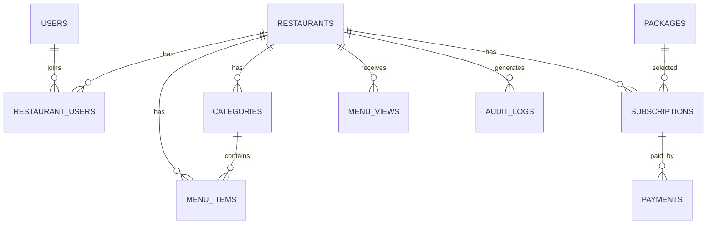

# Database Schema

## 1. Entity Relationship Overview



## 2. `users`

| Column | Type | Notes |
|---|---|---|
| id | bigint | Primary key |
| name | varchar | User name |
| email | varchar | Unique |
| password | varchar | Hashed |
| email_verified_at | timestamp nullable | Email verification |
| is_super_admin | boolean | Admin FTS |
| status | varchar | active, suspended |
| created_at | timestamp | |
| updated_at | timestamp | |

## 3. `restaurants`

| Column | Type | Notes |
|---|---|---|
| id | bigint | Primary key |
| name | varchar | Restaurant name |
| slug | varchar | Globally unique |
| description | text nullable | Public description |
| logo_path | varchar nullable | Storage path |
| cover_path | varchar nullable | Storage path |
| phone | varchar nullable | Contact |
| whatsapp | varchar nullable | Public link |
| instagram_url | varchar nullable | Social link |
| maps_url | text nullable | Location link |
| address | text nullable | Address |
| currency | varchar | Default IDR |
| timezone | varchar | Default Asia/Jakarta |
| theme_key | varchar | Theme selection |
| primary_color | varchar nullable | Custom color |
| public_status | varchar | draft, published, inactive |
| created_at | timestamp | |
| updated_at | timestamp | |
| deleted_at | timestamp nullable | Soft delete |

## 4. `restaurant_users`

| Column | Type | Notes |
|---|---|---|
| id | bigint | Primary key |
| restaurant_id | bigint | Foreign key |
| user_id | bigint | Foreign key |
| role | varchar | owner, manager, staff |
| status | varchar | invited, active, removed |
| created_at | timestamp | |
| updated_at | timestamp | |

Unique constraint:

```text
restaurant_id + user_id
```

## 5. `categories`

| Column | Type | Notes |
|---|---|---|
| id | bigint | Primary key |
| restaurant_id | bigint | Tenant key |
| name | varchar | Category name |
| description | text nullable | Optional |
| sort_order | integer | Display order |
| is_active | boolean | Visibility |
| created_at | timestamp | |
| updated_at | timestamp | |
| deleted_at | timestamp nullable | Soft delete |

Recommended index:

```text
restaurant_id + is_active + sort_order
```

## 6. `menu_items`

| Column | Type | Notes |
|---|---|---|
| id | bigint | Primary key |
| restaurant_id | bigint | Tenant key |
| category_id | bigint | Foreign key |
| name | varchar | Menu name |
| description | text nullable | Menu description |
| price | decimal | Monetary value |
| image_path | varchar nullable | Storage path |
| is_available | boolean | Sold out control |
| is_featured | boolean | Featured section |
| sort_order | integer | Display order |
| created_at | timestamp | |
| updated_at | timestamp | |
| deleted_at | timestamp nullable | Soft delete |

Important validation:

- `category_id` harus dimiliki oleh `restaurant_id` yang sama.
- Harga tidak boleh negatif.
- Gambar harus melalui validasi dan compression.

## 7. `packages`

| Column | Type | Notes |
|---|---|---|
| id | bigint | Primary key |
| name | varchar | Free, Starter, Business, Pro |
| code | varchar | Unique internal code |
| monthly_price | decimal | Monthly price |
| yearly_price | decimal nullable | Yearly price |
| menu_limit | integer nullable | Null means unlimited |
| category_limit | integer nullable | Null means unlimited |
| storage_limit_mb | integer | Storage quota |
| team_limit | integer | User quota |
| has_statistics | boolean | Feature flag |
| has_custom_theme | boolean | Feature flag |
| remove_branding | boolean | Feature flag |
| language_limit | integer | Number of languages |
| is_active | boolean | Sellable status |
| created_at | timestamp | |
| updated_at | timestamp | |

## 8. `subscriptions`

| Column | Type | Notes |
|---|---|---|
| id | bigint | Primary key |
| restaurant_id | bigint | Tenant key |
| package_id | bigint | Selected package |
| billing_cycle | varchar | monthly, yearly |
| status | varchar | trial, active, expired, suspended, cancelled |
| starts_at | timestamp | Start |
| ends_at | timestamp nullable | End |
| cancelled_at | timestamp nullable | Cancellation |
| created_at | timestamp | |
| updated_at | timestamp | |

Only one active subscription should exist for each restaurant.

## 9. `payments`

| Column | Type | Notes |
|---|---|---|
| id | bigint | Primary key |
| subscription_id | bigint | Foreign key |
| restaurant_id | bigint | Tenant key |
| amount | decimal | Paid amount |
| method | varchar | bank_transfer, gateway |
| reference_number | varchar nullable | Payment reference |
| proof_path | varchar nullable | Manual proof |
| status | varchar | pending, approved, rejected, refunded |
| paid_at | timestamp nullable | Payment date |
| verified_by | bigint nullable | Admin user |
| verified_at | timestamp nullable | Verification date |
| notes | text nullable | Admin note |
| created_at | timestamp | |
| updated_at | timestamp | |

## 10. `menu_views`

| Column | Type | Notes |
|---|---|---|
| id | bigint | Primary key |
| restaurant_id | bigint | Tenant key |
| viewed_at | timestamp | View date |
| session_hash | varchar nullable | Privacy-aware unique estimate |
| device_type | varchar nullable | mobile, tablet, desktop |
| referrer | text nullable | Traffic source |
| created_at | timestamp | |

Avoid storing unnecessary personal data.

## 11. `audit_logs`

| Column | Type | Notes |
|---|---|---|
| id | bigint | Primary key |
| restaurant_id | bigint nullable | Tenant context |
| user_id | bigint nullable | Actor |
| action | varchar | created, updated, deleted, login |
| subject_type | varchar nullable | Model type |
| subject_id | bigint nullable | Model ID |
| old_values | json nullable | Previous values |
| new_values | json nullable | New values |
| ip_address | varchar nullable | Security investigation |
| created_at | timestamp | |

## 12. Future Tables

Fitur lanjutan dapat menambah:

```text
menu_item_translations
themes
domains
orders
order_items
tables
reservations
loyalty_customers
coupons
webhook_events
invoices
```
