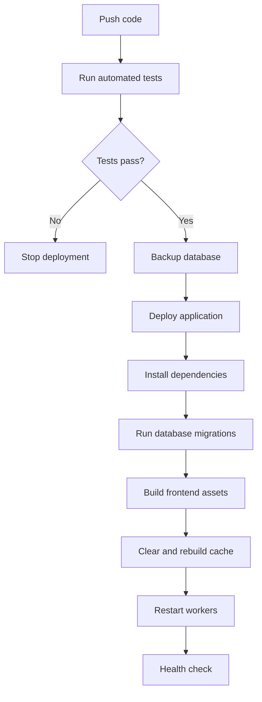

# Deployment

## 1. Environments

```text
Local
Staging
Production
```

### Local

Digunakan developer untuk implementasi dan automated tests.

### Staging

Digunakan untuk:

- Demo kepada Mr. Yoshi.
- Internal review.
- Pilot testing.
- Uji migration dan deployment.

Contoh:

```text
https://menu-staging.fts-tech.co.id
```

### Production

Digunakan pelanggan publik:

```text
https://menu.fts-tech.co.id
```

## 2. Infrastructure Minimum

- Linux server atau managed hosting.
- Supported PHP runtime.
- Database server.
- Web server.
- HTTPS certificate.
- Cron scheduler.
- Backup storage.
- Email delivery configuration.
- Object storage untuk production yang berkembang.

## 3. Deployment Process



## 4. Production Checklist

- `APP_ENV=production`.
- Debug disabled.
- HTTPS active.
- Secure cookie enabled.
- Correct database credential.
- Correct mail credential.
- Correct storage disk.
- Scheduler active.
- Worker process active if queue digunakan.
- Backup scheduled.
- Error monitoring active.
- Log rotation configured.

## 5. Database Migration Rules

- Selalu backup sebelum migration penting.
- Test migration di staging.
- Hindari destructive migration tanpa data migration plan.
- Gunakan nullable column atau staged rollout untuk perubahan besar.
- Siapkan rollback plan.

## 6. File Storage

Jangan bergantung pada local server disk jika deployment bersifat ephemeral atau multi-instance.

Production growth path:

```text
Application -> S3-compatible object storage -> CDN optional
```

## 7. Domain and DNS

MVP menggunakan path-based tenancy:

```text
menu.fts-tech.co.id/{restaurantSlug}
```

Tidak memerlukan wildcard DNS.

Future subdomain model:

```text
restaurant-name.menu.fts-tech.co.id
```

membutuhkan wildcard DNS dan certificate strategy tambahan.

## 8. Monitoring

Pantau minimal:

- Uptime.
- HTTP error rate.
- Application exceptions.
- Database connection.
- Disk atau storage usage.
- Queue failures.
- Backup success.
- SSL expiration.

## 9. Disaster Recovery

Dokumentasikan:

1. Cara restore database.
2. Cara restore file.
3. Cara mengganti credential bocor.
4. Cara rollback deployment.
5. Cara menampilkan maintenance page.
6. Kontak penanggung jawab sistem.
