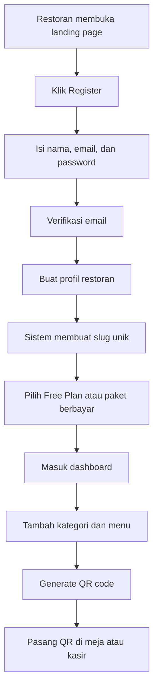
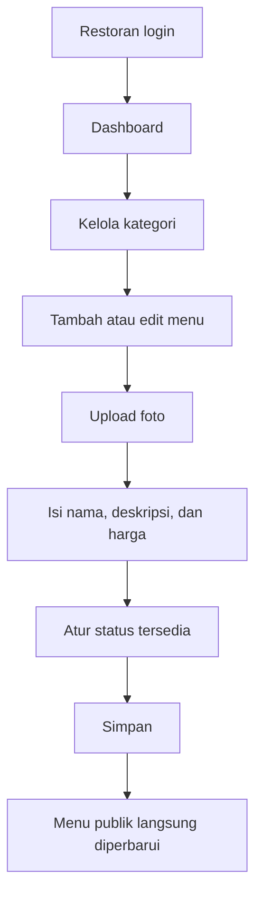
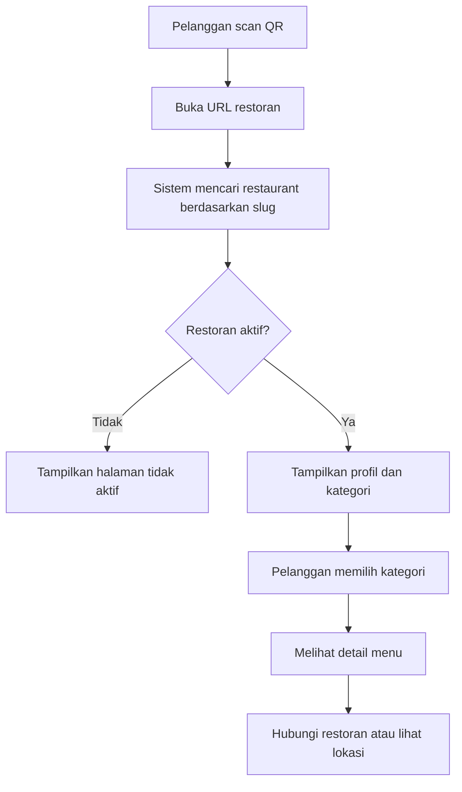
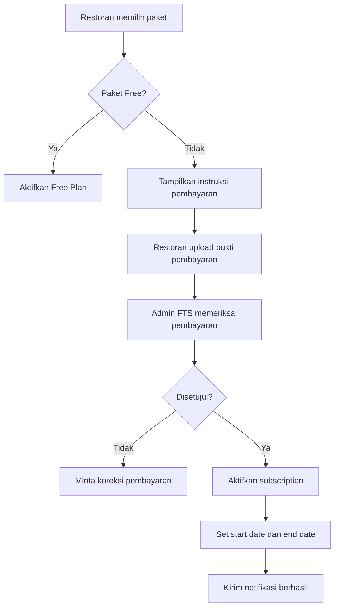

# User dan Business Flow

## 1. Alur Registrasi Restoran



## 2. Alur Pengelolaan Menu



## 3. Alur Pelanggan Restoran



## 4. Alur Subscription



## 5. Alur Upgrade Paket

1. Restoran mencapai batas paket.
2. Sistem menolak penambahan data baru yang melebihi limit.
3. Sistem menampilkan pesan upgrade.
4. Restoran memilih paket baru.
5. Pembayaran diverifikasi.
6. Limit baru langsung diterapkan.

Contoh pesan:

```text
You have reached the Free Plan limit of 10 menu items.
Upgrade to Starter to add more menu items.
```

## 6. Alur Subscription Kedaluwarsa

1. Sistem mengirim pengingat sebelum masa aktif habis.
2. Setelah tanggal berakhir, status menjadi `expired`.
3. Data restoran tidak langsung dihapus.
4. Dashboard dapat tetap diakses secara terbatas.
5. Menu publik dapat menampilkan status tidak aktif.
6. Data disimpan selama periode retensi yang ditentukan FTS.

## 7. Peran Pengguna

### Super Admin FTS

- Akses seluruh restoran.
- Mengelola paket dan pembayaran.
- Menonaktifkan akun bermasalah.
- Melihat audit log dan statistik sistem.

### Restaurant Owner

- Mengelola profil restoran.
- Mengelola anggota tim restoran.
- Mengelola menu dan subscription.

### Restaurant Staff

- Mengelola kategori dan menu sesuai permission.
- Tidak dapat mengubah paket atau kepemilikan restoran jika tidak diizinkan.

### Customer

- Tidak memiliki akun.
- Hanya melihat menu publik.
