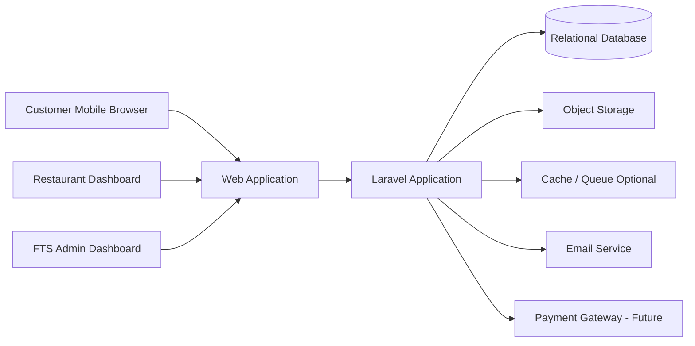

# System Architecture

## 1. Arsitektur Tingkat Tinggi



## 2. Arsitektur MVP

MVP menggunakan monolithic web application karena:

- Lebih cepat dikembangkan.
- Lebih mudah di-deploy.
- Lebih mudah di-maintain oleh tim kecil.
- Belum membutuhkan microservices.

Komponen utama:

```text
Browser
  -> Web Server / Reverse Proxy
  -> Laravel Application
  -> Database
  -> File/Object Storage
```

## 3. Multi-Tenant Strategy

Model awal:

```text
Single Application
Single Database
Shared Tables
Tenant isolation using restaurant_id
```

Contoh:

```text
categories.restaurant_id
menu_items.restaurant_id
subscriptions.restaurant_id
menu_views.restaurant_id
```

Keuntungan:

- Implementasi sederhana.
- Biaya infrastruktur rendah.
- Cocok untuk tahap MVP hingga pertumbuhan awal.

Risiko utama:

- Kebocoran data jika query tidak memiliki filter tenant.
- IDOR jika authorization tidak diterapkan dengan benar.

Mitigasi:

- Gunakan Laravel Policies.
- Gunakan tenant-aware query scopes.
- Gunakan route model binding yang divalidasi terhadap tenant.
- Tambahkan automated authorization tests.

## 4. Context Resolution

Setelah pengguna login, aplikasi menentukan restoran aktif:

```text
Authenticated User
  -> Membership
  -> Active Restaurant
  -> Tenant Context
```

Seluruh operasi dashboard harus menggunakan tenant context, bukan `restaurant_id` dari input bebas pengguna.

## 5. Public Menu Resolution

```text
GET /{restaurantSlug}
  -> Find active restaurant by slug
  -> Validate public status and subscription
  -> Load categories and available menu items
  -> Cache response when appropriate
  -> Render mobile-first public menu
```

Slug harus unik secara global pada versi path-based.

## 6. Storage Architecture

File yang disimpan:

- Logo restoran.
- Cover restoran.
- Foto menu.
- Bukti pembayaran.
- QR code hasil export jika disimpan.

Rekomendasi:

- Development: local disk.
- Production: S3-compatible object storage.
- Simpan path file di database, bukan binary image.
- Gunakan image compression dan generated thumbnail.

## 7. Background Jobs

Queue dapat ditambahkan untuk:

- Kompresi gambar.
- Pengiriman email.
- Pembuatan laporan.
- Subscription reminder.
- Cleanup file yang tidak terpakai.

Untuk MVP kecil, proses ringan masih dapat dijalankan secara synchronous. Queue diaktifkan ketika trafik atau beban mulai meningkat.

## 8. Caching

Data yang dapat di-cache:

- Profil menu publik.
- Daftar kategori.
- Daftar menu aktif.
- Konfigurasi paket.

Cache wajib dihapus ketika restoran memperbarui menu atau profil.

## 9. Skalabilitas Bertahap

### Tahap 1

- Satu application server.
- Satu database.
- Object storage.
- Backup terjadwal.

### Tahap 2

- Redis untuk cache dan queue.
- CDN untuk gambar.
- Separate worker process.
- Monitoring dan centralized logging.

### Tahap 3

- Load balancer.
- Multiple application instances.
- Read replica database jika diperlukan.
- Dedicated analytics pipeline.
